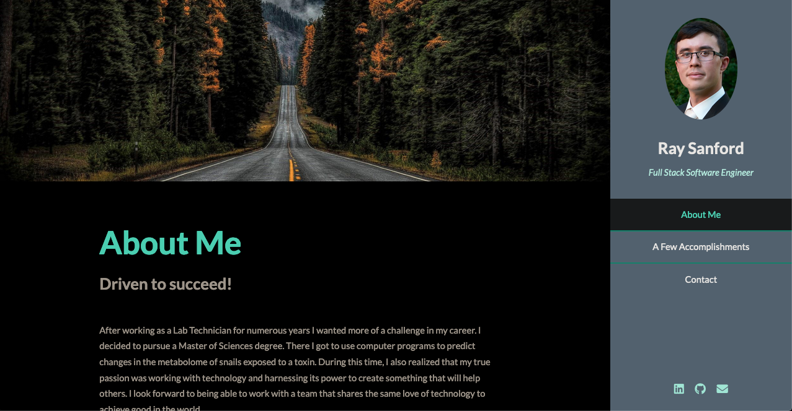

# My Awesome Project
Website to get to know more about me and to showcase what I'm capable of building. 

**Link to project:** https://raysanford.netlify.app

## How It's Made:

**Tech used:** HTML, CSS, JavaScript, 

I incorporated having multiple sections with one section having links to all my different projects.

## Optimizations

## Lessons Learned:

I learned how to get my project live online to be able to share them on my portfolio. 

## Examples:
Take a look at these couple examples that I have in my own portfolio:

**Jack the Balloon Twister:** https://github.com/rs8799/jacktheballoontwister

**Sweet Vegan Baking by Mary:** https://github.com/rs8799/sweetveganbakingbymary

**Portfolio:** https://github.com/rs8799/ray-sanford-portfolio

